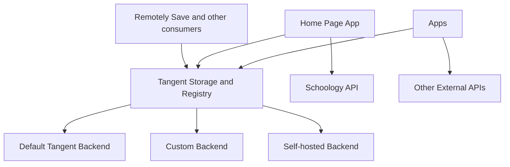

# How will Tangent plug into everything?

Tangent as a computer has very ambitious goals regarding pluggability. Previous versions of Tangent only worked for one or two districts and stored everything for users. Tangent as a computer should be a lot more customizable and assume less.

## Identity, auth, and storage

Emails will remain the primary form of identity and JWTs will remain the primary form of authentication; that's about the only thing staying the same.

You'll have your own storage. It'll be on Tangent by default, but you'll be able to change that. It'll include a "registry" that'll store any value (even ones that override defaults). This will make identity less important: apps (like the home page) will be able to directly using your credentials (like Schoology auth) instead of relying on a database that in turn relies on your identity.

## Tangent plugs in

This was covered a bit already, but the idea is that you'll be able to override Tangent's default API keys, making you rely less on Tangent. This is good for selfhosted users.

## Plug in to Tangent

Tangent will expose its storage, allowing you to sync with Remotely Save in Obsidian.

Tangent might also add a MCP server or other APIs if good tool definitions come to light.

## Diagrammed

